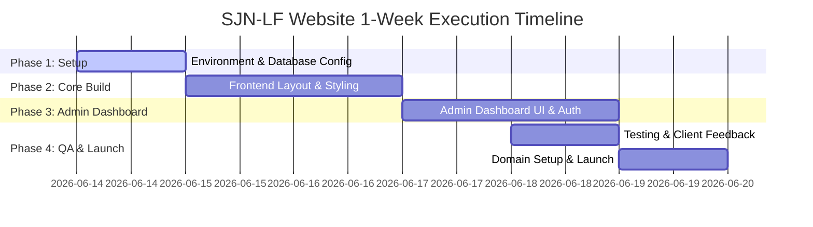

# Strategic Execution Plan: Sir John Ndukwe Legacy Foundation (SJN-LF) Website

**Author:** Strategic Execution Leader  
**Project:** NGO Website  
**Date:** June 13, 2026  

---

# Executive Summary
The Sir John Ndukwe Legacy Foundation (SJN-LF) requires a dynamic, secure, and visually premium web presence within **1 week**. The website will serve as the foundation's primary operational hub, integrating a volunteer database, administrative content manager, and donation facilitation mechanisms. By utilizing a **Next.js + Supabase** serverless architecture, we can deliver a highly performant and secure MVP within the tight deadline with zero ongoing hosting costs. This plan details the execution strategy, milestone roadmap, risk mitigation, and immediate tasks to ensure a successful launch.

---

# Objectives
* **Deliver the MVP within 7 Days:** Launch a responsive website including Home, About, Gallery, News/Events, and Volunteer application forms.
* **Empower Content Editors:** Provide a functional dashboard to upload photos, publish news/events, and update impact stats dynamically.
* **Streamline Volunteer Operations:** Store applicant data in a structured database and provide an administrative status tracking dashboard (Pending, Approved, Rejected).
* **Enable Donations:** Provide immediate bank transfer information and prepare the integration points for automated payment gateways.

---

# Success Metrics
* **Load Time:** Public pages load in < 1.5 seconds (measured by Lighthouse Performance score > 90).
* **User Engagement:** 100% of volunteer signups correctly recorded in the database with instant email notifications sent to admins.
* **Admin Autonomy:** Admins can publish a news update or upload gallery images in under 2 minutes without code modifications.
* **Security:** 100% data encryption in transit (HTTPS) and at rest (Supabase PostgreSQL), with zero exposed API keys or environment variables.

---

# Strategic Roadmap

### Key Milestones
1. **Milestone 1 (Day 1 - Setup):** Repository created, Supabase database schemas deployed, Vercel CI/CD pipeline integrated.
2. **Milestone 2 (Day 3 - Frontend):** High-fidelity Home, About, Gallery, and News page layouts complete with responsive CSS.
3. **Milestone 3 (Day 5 - Backend & Admin):** Volunteer database write actions operational. Admin authentication active. Gallery media uploads and volunteer status processing dashboard fully functional.
4. **Milestone 4 (Day 7 - Launch):** Automated testing, content migration, custom domain setup, and site launch.

---

# Risks

| Risk | Impact | Likelihood | Mitigation Strategy |
| :--- | :--- | :--- | :--- |
| **Content Delay** | High | Medium | Implement high-fidelity templates with placeholder copy. Provide the client with clear content submission templates on Day 1. |
| **Payment Approval Lead Time** | High | High | Use manual bank details and receipt upload forms as the default donation flow for launch. Integrate automated gateways in parallel. |
| **Dashboard Scope Creep** | Medium | Medium | Limit Admin Dashboard features strictly to volunteer list processing, news publishing, and image uploads. Defer export tools or roles to Phase 2. |

---

# Recommended Actions
1. **Execute Database Provisioning:** Initialize Supabase instance and run migrations for `volunteers`, `news_events`, and `gallery` tables immediately.
2. **Onboard Client to Content Template:** Deliver a brief content outline sheet (bios, past activities pictures, impact numbers) to the client on Day 1.
3. **Launch Payment Gateway Registration:** Instruct the client to submit registration documents to Paystack/Flutterwave on Day 1 to run approvals concurrently.

---

# Next 7 Days (Launch Cycle)
* **Day 1 (Setup):** Setup Git, Vercel, Supabase. Deploy database schemas, Row Level Security (RLS) policies, and storage buckets.
* **Day 2-3 (Frontend Layouts):** Build core page layouts (Home, About, News, Gallery) using Next.js App Router and Vanilla CSS modules.
* **Day 4 (Backend Integration):** Build volunteer application form and route writes directly to Supabase. Implement Cloudflare Turnstile spam protection.
* **Day 5 (Admin Portal):** Secure `/admin` sub-routes with middleware. Build simple volunteer review table and news post editor.
* **Day 6 (Testing & QA):** Perform responsive validation, cross-browser tests, form validation checks, and email route verifications.
* **Day 7 (Launch):** Map `sirjohnndukwelegacyfoundation.org` DNS to Vercel, trigger production build, and deliver to the client.

---

# Next 30 Days (Operationalization)
* **Content Population:** Client routinely adds updates to the news section and populates the image gallery.
* **Gateway Activation:** Swap manual donation flow with automated Paystack/Flutterwave API triggers once approved.
* **Staff Training:** Conduct a 30-minute walkthrough with foundation staff on managing volunteers and publishing content.

---

# Next 90 Days (Expansion & Scale)
* **Volunteer Engagement:** Add automatic email triggers (via Resend) when status updates occur.
* **Analytics Review:** Connect privacy-focused web analytics to track donation conversions and page performance.
* **Advocacy Expansion:** Introduce newsletter marketing integrations (e.g., Mailchimp) for recurring updates.

---

# Strategic Verdict
* **Execution Status:** **Ready for Production** (under a Next.js + Supabase serverless delivery model).
* **Recommendation:** Initiate execution phase immediately using the Day 1 tasks. The 1-week timeline is highly achievable if the scope is restricted strictly to the defined MVP requirements.

---

# JBK Brain Awareness & Knowledge Handoff

### Candidate Brain Entry
We propose promoting this Strategic Execution Plan to the JBK Brain.

* **Proposed Path:** `Strategy/SJN-LF-Execution-Roadmap.md`
* **Core Strategy:** Phase-based execution targeting a 7-day launch, prioritizing manual donation fallbacks to bypass payment regulatory delays.
